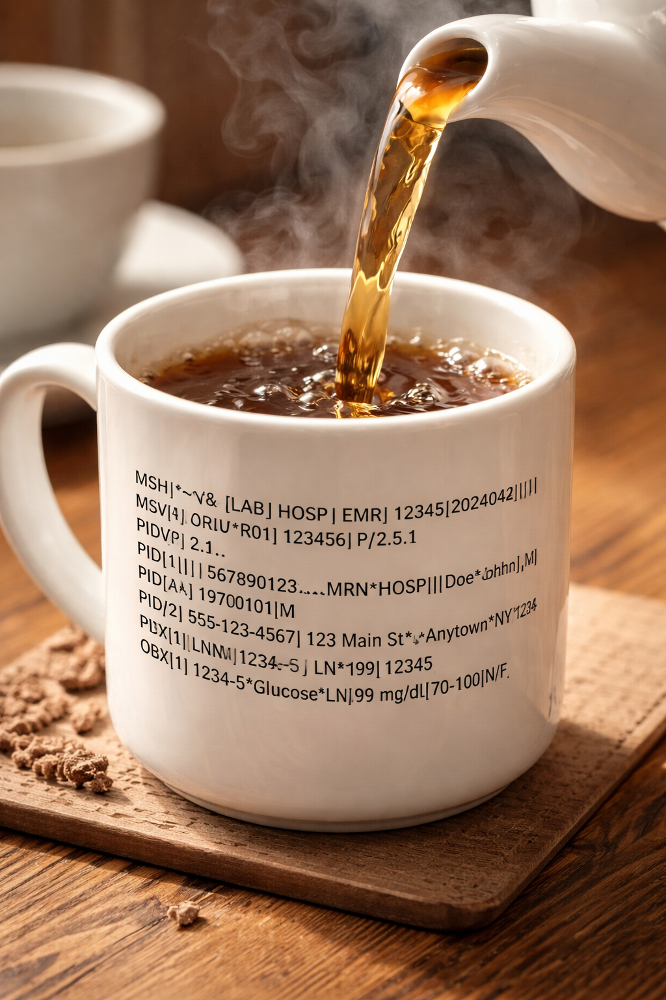

HL7.Tea
==========



**HL7.Tea** is a package for parsing and transforming and manipulating and transmitting **HL7v2** data.

## Table of Contents
- [Installation](#installation)
- [Loading HL7v2 Data](#load-hl7v2-data)
- [Retrieving Data](#retriving-data)
- [Setting Field Values](#setting-field-values)
- [Inspecting Message](#inspecting-messages)
- [Data Mapping](#data-mapping)
- [Promotions](#promotions)
- [Transformation](#transformation)
- [MLLP Data Transport](#mllp-data-transport)
- [Helper Functions](#helper_functions)
- [Development Requests](#development-requests)


## Installation
Using package manager:
`Install-Package HL7.Tea`
Using dotnet:
`dotnet add package HL7.Tea`
Using nuget:
`nuget install HL7.Tea`

## Loading HL7v2 data
Example:
```csharp
using HL7.Tea.Core;
string msgStr = @"MSH|^~\\&|ADM|RCH|||202403270202||ADT^A03|4425797|P|2.4||||NE
EVN|A03|202403270202|||UNKNOWN^RUN^MIDNT^^^^^^^^^^U|20240326
PID|1||RC123^^^^MR^A~9872360649^^^^HCN^B~123^^^^PI^A~E456^^^^EMR^B~66292A7E8541^^^^PT^A||MICROTEST^CRIT^ONE^^^^L~OPENHOUSE^CRIT^ONE^^^^A||19690414|F|||123 MAIN ST^^Seattle^WA^12345^CAN||(896)321-4545^PRN^CELL||ENG|||RC1234/24|3452353232
PV1|1|O|RC.ERZ1|||ER-ERIN1^ERERINZ1-1^IRM|LABTESTG1^Labtest^Generic Doc1^Doc1^^^MD^^^^^^XX|||||||||||RCR||CL|||||||||||||||||||RCH||DIS|||202309081450|202403260001|
GT1|768||Doe^Jane
ZFH|CVC|V|F||test1@gmail.com
ZFH|CVC|C|F||test2@gmail.com|hi^there";

var msg = new HL7Message(msgStr);
```
 
```shell
Jane
```
## Retrieving Data:
You can retrieve data by calling `GetFieldOne` or `GetFieldAll`.
`GetFieldOne` returns a string value and is the most commonly used method.
`GetFieldAll` returns a list of string. It can be used either when you have repeated fields or repeated segments.

Example 2:
```csharp
Console.WriteLine(string.Join(", ", msg.GetFieldAll("PID-3")));
```

```shell
RC123^^^^MR^A, 9872360649^^^^HCN^B, 123^^^^PI^A, E456^^^^EMR^B, 66292A7E8541^^^^PT^A```

The example below shows how you can loop through values using `GetFieldAll` and check a subfield using `GetSubfield`.

Example:
```csharp
var msg = new HL7Message(msgStr);
foreach (var pid3 in msg.GetFieldAll("PID-3"))
{
    if (Helpers.GetSubfield(pid3, 6) == "A")
        Console.WriteLine("PID-3.5 = " + Helpers.GetSubfield(pid3, 5));
}
```

```shell
PID-3.5 =  MR
PID-3.5 =  PI
PID-3.5 =  PT
```

Example: You loop through the segments and inspect them or modify them in a loop:
```csharp
var msg = new HL7Message(msgStr);
foreach(var seg in msg.Segments){
    if (seg.Name == "ZFH")
        Console.WriteLine(seg.GetFieldOne("ZFH-5"));
}
```

```shell
test1@gmail.com
test2@gmail.com
```

Note that the segments variable is a list of Segment objects.

## Setting Field Values
To set field values use `SetField` as shown below:
```csharp
msg.SetField("ZFH-2", "123");
```

Example: This example shows how to set sub-fields:
```csharp
var msg = new HL7Message(msgStr);
var subField = msg.GetFieldOne("PV1-6.3");
Console.WriteLine(subField);
```

```shell
IRM
```

If you want to remove a field, use the `RemoveField` method but be warned that this will shift all following fields.
```csharp
msg.RemoveField("ZFH-2");
```

If you just want to empty the value, you must do it like this:
```csharp
msg.SetField("ZFH-2", "");
```

## Inspecting Messages
The `Content` property gives you the hl7 message.
```
string res =  msg.Content;
```
Note that it uses carriage return rather than line feedback which can be confusing in the terminal.
If you cast msg to str, then it will have '\r\n' which is more suitable for terminal debugging.

## Data Mapping
There are currently 2 methods of mapping supported:
- **Direct Mapping:** you can specify the segment name and optionally the field and they will be directly copied
- **Conditional Mapping:** you can specify a condition in the form of a function and pass it to map.
The condition can be on the segment of the field. 
 
You can map fields using the method `DirectMap`.
You can specify either the segment name, or field or subfield.

Example:
```csharp
using HL7.Tea.Core;
var src = new HL7Message(TEST_MSG);
var dst = new HL7Message();
Mapper.DirectMap(src, dst, new List<string> {"MSH", "PID", "PV1-1", "ZFH-1", "ZFH-2", "ZFH-4", "ZFH-5" });
Console.WriteLine(res);
```

Note that the mapper keeps the order of the segments.

Example: This example demonstrates **conditional mapping** of repeated fields.
```csharp
using HL7.Tea.Core;

var src = new HL7Message(TEST_MSG);
var dst = new HL7Message();
Mapper.DirectMap(src, dst, new List<string> { "MSH" });


dst.SetField("PID-3", "");
Func<object, bool> pid3MappingCondition = pid3 =>
    Helpers.GetSubfield((string)pid3, 6) == "A";

Mapper.ConditionalMap(src, dst, "PID-3", pid3MappingCondition);
Console.WriteLine(dst);
```

```shell
MSH|^~\\&|ADM|RCH|||202403270202||ADT^A03|4425797|P|2.4||||NE
PID|||RC123^^^^MR^A~123^^^^PI^A~66292A7E8541^^^^PT^A
```

## Promotions
Example 6: The example below demonstrate how you can promote properties:
```csharp
HL7Message msg = new HL7Message(TEST_MSG);
            msg.Promote(new Dictionary<string, string>{
                { "message_type", "MSH-9.1" },
                { "trigger_event", "MSH-9.2" }
            });
Console.WriteLine(msg.GetPromotion("message_type"));
```

```shell
ADT
```

## Transformation
Transformation allows you to substitute values in the message. Below is the list of possible substitutions:

| Value    | Description |
| --------- | ------- |
| {now}     | Inserts the current date/time in the 12 digit format        |
| {now.12}     | Same as {now}        |
| {now.14}     | Inserts the current date/time in the 14 digit format        |
| {random_num}          | Generates a random 6 digit number        |
| {random_first_name}          | Generates a random first name        |
| {random_last_name}          | Generates a random last name        |

Example: Put a random first name into PID-5.2 and print the value
```csharp
var msg = new HL7Message(TEST_MSG);

var specs = new Dictionary<string, string>
{
    { "PID-5.2", "{random_first_name}" }
};

msg.Transform(specs);
var firstName = msg.GetFieldOne("PID-5.2");
```


## Helper Functions

Example: To get patient's age:
```csharp
var msg = new HL7Message(TEST_MSG);
var res = msg.GetPatientAge();
Console.WriteLine(msg.GetPatientAge());
```


## Development Requests
Feel free to reach out if you want to request a new feature.
